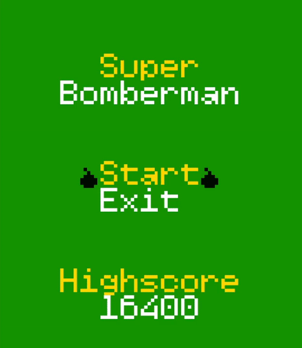

## LDTS_0102 - Super Bomberman

----
Neste jogo de estratégia jogas com um homem que está preso num labirinto! Coloca bombas cronometradas para matar os montros que encontras ao longo do caminho. Se eles forem apanhados na explosão da bomba, vão desaparecer!
Também podes explodir paredes com as bombas, onde podes encontrar tesouros que te vão ajudar no teu caminho, e também a saída! Se acidentalmente a explosão passar no tesouro ou na saída, um monstro vai aparecer e vir atrás de ti!

Super Bomberman é um jogo com vários níveis, e onde te poderás superar a tentar utrapassar a tua melhor pontuação de outras partidas! Mata monstros, parte paredes, foge das explosões, e o mais importante, diverte-te!

Este projeto foi desenvolvido por [António Azevedo](https://github.com/xubby), [José Martins](https://github.com/ZeAntonioM) e [Sérgio Peixoto](https://github.com/ShadowPT) para LDTS 2022/23

----
## CONTROLOS

```↑``` : Move o Bomberman para cima.  
```←``` : Move o Bomberman para a esquerda.  
```↓``` : Move o Bomberman para baixo.  
```→``` : Move o Bomberman para a direita.  
```SPACE``` : Coloca uma bomba.  
```ESC``` : Abre o Menu de Pausa.  
```ENTER``` : Selecionar opções.  


---

## Pequena Demo do Jogo

