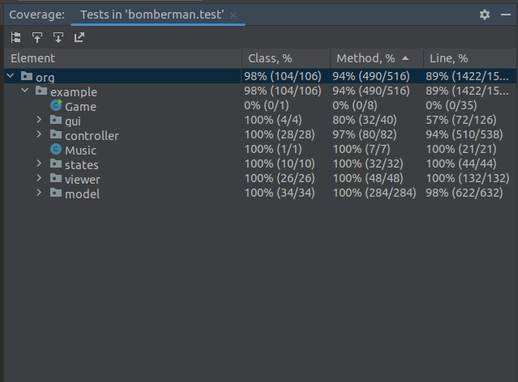

# LDTS_0102 - Super Bomberman

Neste jogo de estratégia jogas com um homem que está preso num labirinto! Coloca bombas cronometradas para matar os montros que encontras ao longo do caminho. Se eles forem apanhados na explosão da bomba, vão desaparecer!
Também podes explodir paredes com as bombas, onde podes encontrar tesouros que te vão ajudar no teu caminho, e também a saída! Se acidentalmente a explosão passar no tesouro ou na saída, um monstro vai aparecer e vir atrás de ti!

Super Bomberman é um jogo com vários níveis, e onde te poderás superar a tentar utrapassar a tua melhor pontuação de outras partidas! Mata monstros, parte paredes, foge das explosões, e o mais importante, diverte-te!

Este projeto foi desenvolvido por [António Azevedo](https://github.com/xubby), [José Martins](https://github.com/ZeAntonioM) e [Sérgio Peixoto](https://github.com/ShadowPT) para LDTS 2022/23

-----

### DIAGRAMA DE CLASSES

## FEATURES IMPLEMENTADAS

- **Pontuação** - O bomberman ganha pontos ao matar monstros. A pontuação é mostrada no ecrã.
- **Vidas** - O bomberman tem 3 vidas inicialmente. Se o bomberman levar dano, perde uma vida. Se o bomberman não tiver vidas, o jogo acaba. O número máximo de vidas é 5. O número de vidas é mostrado no ecrã.
- **Menu Inicial** - O menu inicial do jogo permite ao jogador ver a sua melhor pontuação, e escolher entre jogar ou sair do jogo.
- **Movimentação dos monstros** - Os monstros movem-se até encontrar uma parede. Quando encontram uma parede, mudam de direção.
  

- **Menu de Pausa** - O menu de pausa permite ao jogador voltar ao menu inicial, recomeçar o jogo, ou continuar a jogar.

- **Menu de Game Over** - O menu de game over permite ao jogador verificar o seu score, e, no caso de ter batido a sua melhor pontuação, recebe uma mensagem de congratulações.

- **Música** - O jogo tem música de fundo, uma para o jogo a decorrer, e uma para cada menu.
- **Saída** - Durante o jogo, ao explodir uma parede, existe uma probabilidade de nascer a saída para o próximo nível. No entanto, esta só pode ser acessada quando todos os monstros forem derrotados.
- **Explosão colide com Saída** - De modo a dinamizar a gameplay, a explosão das bombas não pode destruir a saída, porém, se a explosão passar por ela, um monstro aparece.
- **Nova arena** - Ao passar pela saída, o jogador é transportado para uma nova arena, com um novo layout, e com novos monstros, mantendo na mesma a sua pontuação, powerups, e vidas.

> Este gif demostra a criação de um novo Monstro após a explosão colidir com a saída. Nesse momento a mesma torna-se preta, o que significa que está fechada. Quanto todos os monstros são derrotados, a saída torna-se branca, e de novo o jogador pode passar para o próximo nível. Ao colidir com a saída, uma nova arena é gerada.  
- **Níveis dos monstros** - Os monstros têm níveis, referentes à sua cor e à pontuação que dão ao serem mortos:
    1. Os monstros de cor azul são os menos valiosos, dando apenas 200 pontos.
    2. Os monstros de cor amarela dão 400 pontos.
    3. Os monstros de cor vermelha são os mais valiosos, dando 800 pontos.
       
       
- **PowerUps** - Durante o jogo, ao explodir uma parede, existe uma probabilidade de nascer um powerup. Os powerups são:
    1. **Bomba** - Aumenta o número de bombas que o bomberman pode colocar ao mesmo tempo.
       
       
        > É possível verificar também a movimentação de um monstro neste gif. Este move-se até encontrar uma parede, e depois muda de direção, podendo voltar para trás ou mover-se para a esquerda. 
    2. **Raio** - Aumenta o raio da explosão das bombas em 1. Pode ser uma arma forte no inicio, porém, com o passar do tempo torna-se uma faca de dois gumes, pois o raio das bombas aumenta, e o jogador pode ser morto por uma explosão.
       
       
    3. **Invencibilidade** - O bomberman fica invencível durante 5 segundos.
       
       
    4. **Vidas** - Aumenta o número de vidas do bomberman, podendo aumentar entre 1 a 3 vidas.
       
       
- **Bomberman invencivel quando leva dano** - O bomberman fica invencível durante 5 segundo quando leva dano, e volta à posição original.
  
  
- **Explosão colide com PowerUps** - A explosão das bombas destroi os powerups.
  
  
  - **Animação do Bomberman, Explosões e paredes a serem destruidas** - O Bomberman, as explosões e as paredes a serem destruidas têm animações.

----

### PADRÃO DE ARQUITETURA

**Contexto do problema**

A arquitetura de um projeto é uma das escolhas mais importantes no desenvolvimento de um projeto, e tem de ser planeado desde o início, para haver organização e para ajudar na construção do mesmo.

No nosso projeto, é importante que se separem os dados, as interfaces e o controlo do jogo, para haver maior reutilização de código e para facilitar a implementação de novo código.
Com a solução que usamos, impedimos que seja quebrado o **Single Responsability Principle (SRP)**.

**Pattern utilizado**

Decidimos usar o método MVC como a arquitetura do nosso programa, visto ser o modelo mais viável para contrução e organização de código.

Neste método, o código é organizado em três elementos diferentes:
- **Model** : contém os dados do programa;
- **View** : contém as interfaces do programa;
- **Controller** : Controla os dados e as interfaces.

**Implementação**

O método MVC é organizado da seguinte forma:

Como podemos verificar, o Model não tem dependências, o View depende do Model e o Controller depende do Viewer e do Model.

**Consequencias**

- Fácil de modificar;
- É melhor para testar;
- Como foi dito anteriormente, devido à separação em 3 elementos, a dependência do código está melhor estruturada;
- Alta coesão, ou seja, todo o código acaba por se relacionar, ainda que esteja separado entre os 3 elementos.
- O MVC leva a bastantes Code Smells, dado que pode levar a uma classe usar mais os dados de outras classes, o que pode levar a um código mais complexo, difícil de ler e de modificar.

### A TELA DO UTILIZADDOR DEVE MUDAR DE ACORDO COM A FASE EM QUE SE ENCONTRA

**Contexto do problema**

O utilizador deve ter uma experiência de jogo agradável, e para isso, é necessário que a interface do jogo mude de acordo com a fase em que se encontra. Se o jogador iniciou a aplicação deve ver a tela de menu, se o jogador está a jogar deve ver a tela de jogo, se o jogador pausou deve ver a tela de pausa, e se o jogador perdeu deve ver a tela de game over.

**The Pattern**

Aplicamos o **State** pattern. Este pattern permite que o comportamento de um objeto mude conforme o seu estado interno. O Game muda de estado quando é chamado um método que altera o seu estado interno. O Game tem um estado inicial, que é o estado de menu, e quando o jogador clica no botão de iniciar o jogo, o estado do Game muda para o estado de jogo. Quando o jogador clica no botão de pausar o jogo, o estado do Game muda para o estado de pausa. Quando o jogador clica no botão de voltar ao menu, o estado do Game muda novamente para o estado de menu. Quando o jogador perde todas as vidas, o estado do Game muda para o estado de game over.

**Implementation**

A figura seguinte mostra como acontece a troca de states do jogo.

  

Estas classes podem ser encontradas nos seguintes ficheiros:

- [Game](../src/main/java/org/example/Game.java)
- [GameOverScreenState](../src/main/java/org/example/states/GameOverScreen.java)
- [GameState](../src/main/java/org/example/states/GameState.java)
- [MenuState](../src/main/java/org/example/states/MenuState.java)
- [PauseMenuState](../src/main/java/org/example/states/PauseMenu.java)

**Consequências**

O uso do State Pattern no design atual permite os seguintes benefícios:

- O código fica mais fácil de manter e de extender. Se quisermos adicionar um novo estado ao jogo, basta criar uma nova classe que implemente a interface State e adicionar um novo estado ao Game. Se quisermos adicionar um novo comportamento ao jogo, basta adicionar um novo método à interface State e implementá-lo nas classes que implementam a interface State.
- Não precisamos de ter uma longa lista de condicionais if ou switch associados aos vários estados; em vez disso, a polimorfia é usada para ativar o comportamento correto.
- O código é mais fácil de testar, pois cada classe que implementa a interface State pode ser testada individualmente.
- Existem mais classes, mas o código é mais fácil de ler e de entender, pois cada classe tem um único propósito, e o número de classes ainda é relativamente pequeno.
----
### GAMELOOP

**Contexto do problema**

O Jogo deve ser continuamente atualizado, ainda que o jogador não faça nenhuma ação. 
Por exemplo, se o jogador estiver a jogar, o jogo deve atualizar a posição dos inimigos
e deve continuar a contar o tempo das bombas. Além disso, as animações teem de ser 
constantemente atualizadas.

**Pattern utilizado**

Para isso, usamos o **GameLoop** pattern, um loop infinito que atualiza o jogo continuamente. O GameLoop é executado continuamente, para que o jogo possa ser atualizado continuamente, mesmo que o jogador não faça nenhuma ação.

**Implementação**

O game loop é executado continuamente durante o jogo. A cada loop, ele processa o input do utilizador sem bloquear, atualiza o state e renderiza o jogo. Também controla a passagem do tempo para controlar a taxa de jogo.

> Fonte: [GameLoop](https://gameprogrammingpatterns.com/game-loop.html)

**Consequencias**

O uso do GameLoop no design atual permite os seguintes benefícios:

- É possivel atualizar o estado do jogo continuamente, mesmo que o jogador não faça nenhuma ação.
- É possivel controlar a taxa de jogo, ajudando em eventos cronometrizados e nas animações.
----
### FACTORY PATTERN NOS STATES

**Contexto do problema**

Dependendo dos vários contextos da nossa aplicação, i.e. se o utilizador está no ecrã do jogo ou está no ecrã do menu,
o mesmo deve ser atualizado de forma diferente. Por exemplo, se o utilizador está no ecrã do jogo, o jogo 
deve atualizar a posição dos inimigos e deve continuar a contar o tempo das bombas. Se o utilizador está no ecrã do 
menu, o jogo não deve atualizar a posição dos inimigos nem deve contar o tempo das bombas.
Assim, cada um destes contextos pode-se entender como um estado diferente. 
Para isto, foi necessário haver uma maneira fácil e eficiente de implementar novos estados consoante o pretendido.

**Pattern utilizado**

Para isso foi utilizado o **Abstract Factory Pattern**. Este pattern permite criar uma família
de objetos relacionados ou dependentes sem especificar as suas classes concretas. O Abstract Factory
Pattern é usado quando temos uma superclasse com várias subclasses e baseado na entrada, precisamos
retornar uma subclasse específica. Este pattern cria objetos sem expor a lógica de criação ao
cliente e se refere à criação de objetos como um processo de vários passos.

**Implementação**

**Consequencias**

O uso do Abstract Factory Pattern no design atual permite os seguintes benefícios:

- Segue **Single Responsibilty Principle**, pois cada classe tem um único propósito.
- Segue **Open/Closed Principle**, pois é fácil de estender, uma vez que basta adicionar uma nova classe 
que implemente a classe abstrata State.

### REFACTORING FEITO AO LONGO DO DESENVOLVIMENTO

#### GAMECONTROLLER REMOVIDO
Inicialmente, seguindo o modelo do Hero Solid, tínhamos um GameController, uma classe abstrata que era herdada por todas as classes que representavam um controller do jogo a decorrer.
No entanto, esta classe não é necessária, uma vez que teria apena um construtor que chamaria o construtor da classe Controller. 
Assim, cada Controller passou a herdar diretamente da classe Controller.

#### MUSICA PASSADA COMO ATRIBUTO NO CONSTUTOR DE CADA ESTADO
Quando decidimos colocar música no projeto, colocamos cada música como um atributo de cada estado, já predefinido como static.
No entanto, isto faria com que cada arena tivesse a mesma música, o que iria deixar uma possível futura alteração mais confusa. Caso se quisesse alterar a música de uma arena, teria de se alterar a música na própria classe.
Assim, decidimos que a música de cada estado deveria ser passada como um atributo no construtor de cada estado. Isto permite que seja feita uma função que altera a música de cada estado, podendo aumentar a flexibilidade do projeto.

#### MOVIMENTAÇÃO DOS MONSTROS
Inicialmente, os monstros moviam-se aleatoriamente, sem qualquer lógica. No entanto, isto não fazia sentido, dado que os monstros não se moviam de forma inteligente, e ainda poderiamos acabar em casos onde os monstros iriam mover-se uns para cima dos outros.
Assim, decidimos que os monstros deveriam ter uma lógica de movimento, de forma a que se moviam de forma inteligente. 
A forma mais simples de fazer isto foi usar a mesma lógica do jogo original, onde os monstros se movem até encontrar um obstáculo, e depois mudam de direção.
Assim, mantemos um código com lógica, simples e fácil de entender, e que se assemelha ao jogo original.

----

### CODE SMELLS CONHECIDOS E SUGESTÕES DE REFACTORING

#### POSSIVEL CRIAÇÃO UMA CLASSE ANIMAÇÃO PARA GERIR AS ANIMAÇÕES
Após a decisão do uso de animações, decidimos dar update do estado das animações através de uma
atualização de caractér numa função localizada no Controller.
No entanto, isto viola o Single Responsibility Principle, dado que cada controller acaba por 
gerir o estado das animações e o estado do seu elemento.
Assim, um possivel refactoring era fazer com que o estado das animações deveria ser gerido por uma nova classe Animation, 
que seria responsável por gerir o estado das animações e por atualizar o estado das animações.
Portanto, todos os elementos com animações passariam a ter uma instância da classe Animation, 
responsável por gerir o estado das animações.

#### MÉTODOS MUITO LONGOS NOS CONTROLLERS
Para verificação de colisões, alguns metodos steps dos controllers acabaram por ficar muito extensos.
Isto faz com que o código fique mais difícil de ler e de entender, e também dificulta a manutenção do código.
Assim, seria interessante refatorar o código para que os métodos steps ficassem mais curtos, e que o código ficasse mais fácil de ler e de entender.

#### VIOLAÇÃO DE OPEN-CLOSED PRINCIPLE

Na classe Monster, temos uma violação do Open-Closed Principle, dado que a classe não está aberta a extensão, dado que não é possível adicionar novos monstros sem alterar a classe.
A cada monstro adicionado será necessário adicionar o novo tipo de caractér ou nivel ao switch case.
Para resolver este problema, poderíamos usar o Factory Pattern, de modo a que cada tipo de mostro tivesse o seu próprio método de criação,
e que cada nível da arena tivesse os seus próprios monstros previamente criados.

### TESTES

#### Testes Unitários com covertura de 94%

#### Testes com pitest
- [Link to mutation testing report](./index.html)

#### **Testes com BetterCodeUp**
- [Link to BetterCodeUp report](./bettercodehub.html)

### AUTO-AVALIAÇÃO

- António Azevedo: 33.3%
- José Martins: 33.3%
- Sérgio Peixoto: 33.3% 